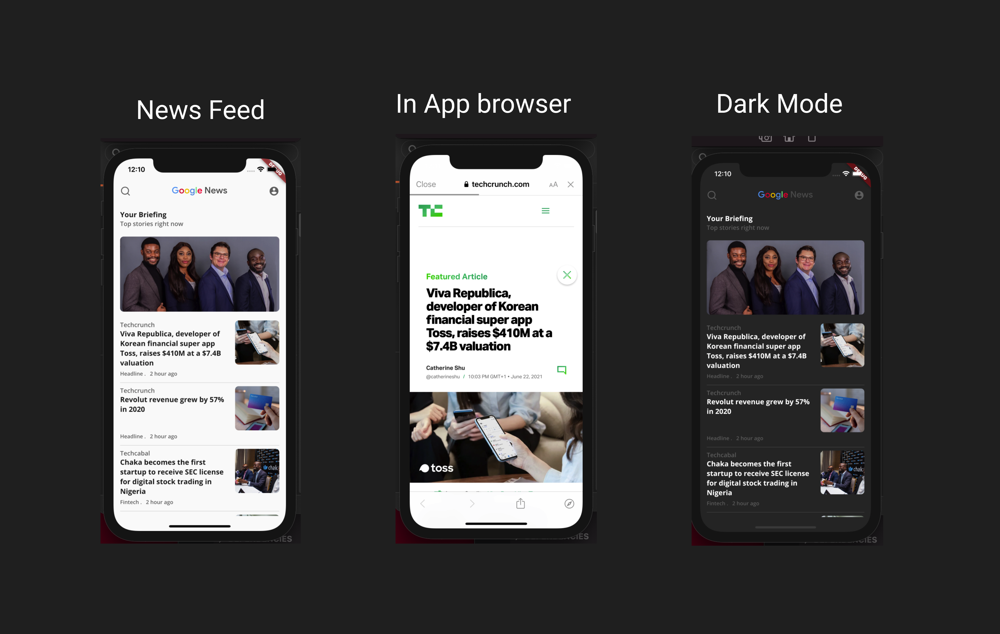

# google_news_clone

Google News clone app using Flutter and HarperDB.

## Getting Started

This project is a simple Google news clone app with HarperDB backend built with Flutter. You simply seed data to HarperDB using Postman and fetch using an network library of your choice. For this project, I am using [Dio](https://pub.dev/packages/dio).

A few resources to get you started if this is your first Flutter project:

- [Lab: Write your first Flutter app](https://flutter.dev/docs/get-started/codelab)
- [Cookbook: Useful Flutter samples](https://flutter.dev/docs/cookbook)
- [HarperDb API](https://harperdb.io/)

For help getting started with Flutter, view our
[online documentation](https://flutter.dev/docs), which offers tutorials,
samples, guidance on mobile development, and a full API reference.
